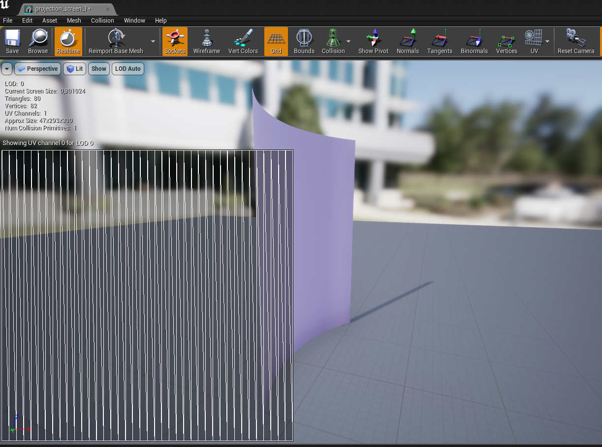
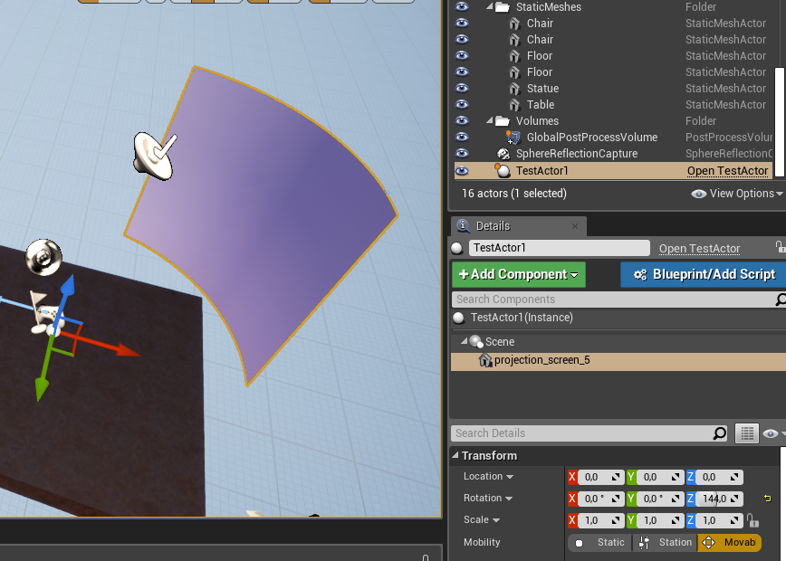
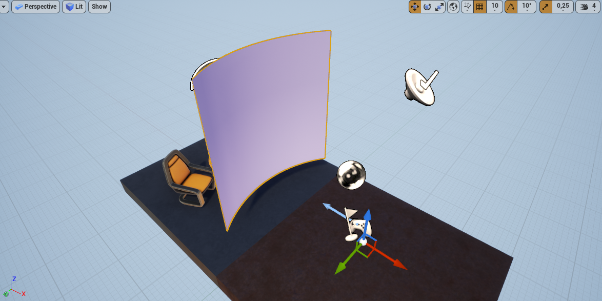
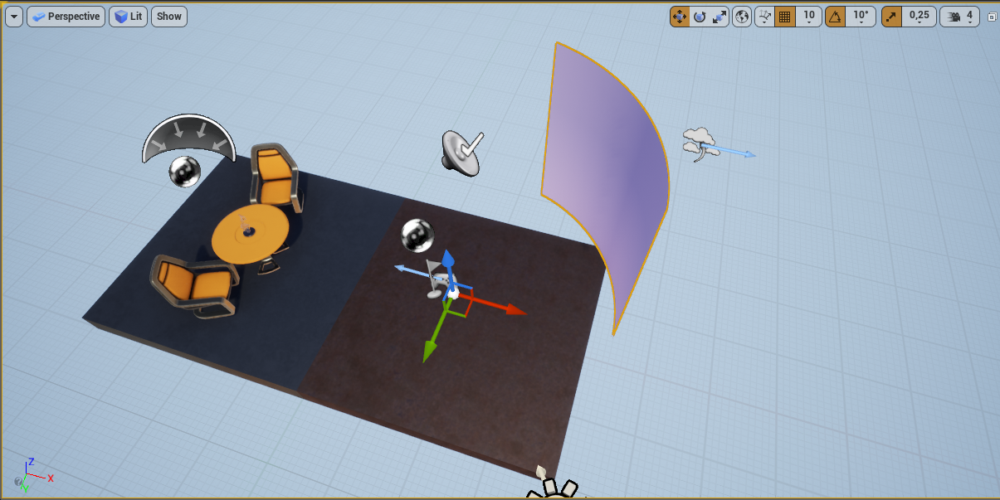

# PFM Generator (cppTest4 ^^)

PFM Generator is an Unreal Engine project for generating PFM geometry files for use with nDisplay plugin.

# Process:
  - Create the right mesh
  - Attach a mesh to the "script attached actor as a child"
  - Export

-----------------
### 1. Creating the right mesh file

In order to know what mesh file you need, you need to know the aspect ratio you will be using for that 
paticular projection and the shape/orientation/curve of the space you will be outputing. In the example's 
case we needed a curved mesh that from a frontal point of view had a 1:1 ratio. The UV of the mesh has to be
full as the output is mapped by it. The mesh was wider of course, but the UV was streched a bit to be full. 
Be carefull when streching the UV as it will strech the output (if streching be sure to do it same in both
dimesions to minimize the output strech). Here is the mesh we used and it's UV map:

Besides the full UV, all you need to take care of is that the mesh has a desirable shape from a desirable 
point of view.

### 2. Attach a mesh to the "script attached actor as a child"

Ignoring the confusing title, we need to create an actor which has the TestActor.cpp component. It also needs to have
a child that can not be a mesh, and that child will be the parent to our mesh:

Now, the position of the parent should not be changed and the position of the default player should not be changed.
The forward direction of the default player is the default direction the script will use. So for making a PFM for a
display that will be in front, you should put the mesh in front:

A PFM that will be for a display that will be for a display that will be on the back right:

Take notice! this dirrection will override your viewports in the config file for nDisplay i you use the origin=mpcdi_origin tag. No matter where your viewport is looking,
the direction will be overwritten by the PFM direction. (May change in the future as it was not logical)

Also make sure that the distance of the mesh from the world center is the same as the viewports in the nDis config file. The hight/scale/rotation of the
mesh will effect the output.

### 3. Export

Just press the play button and a file names "Stagodalo" will be created in the Engine/Binaries/Win64 folder of your UnrealEngine location. You should just add a .pfm extension
and the file will be ready.